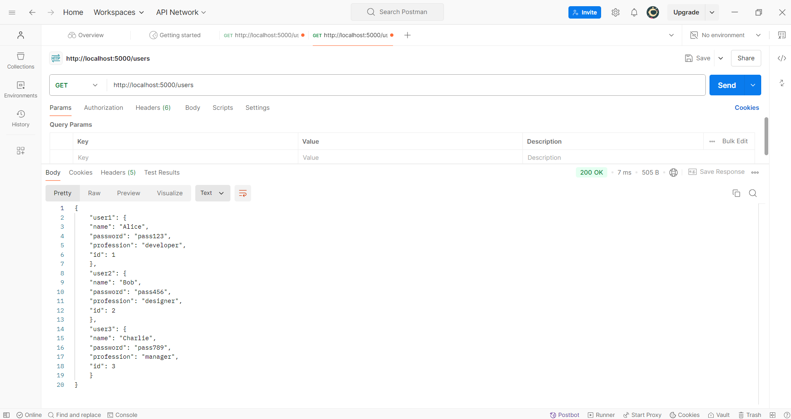
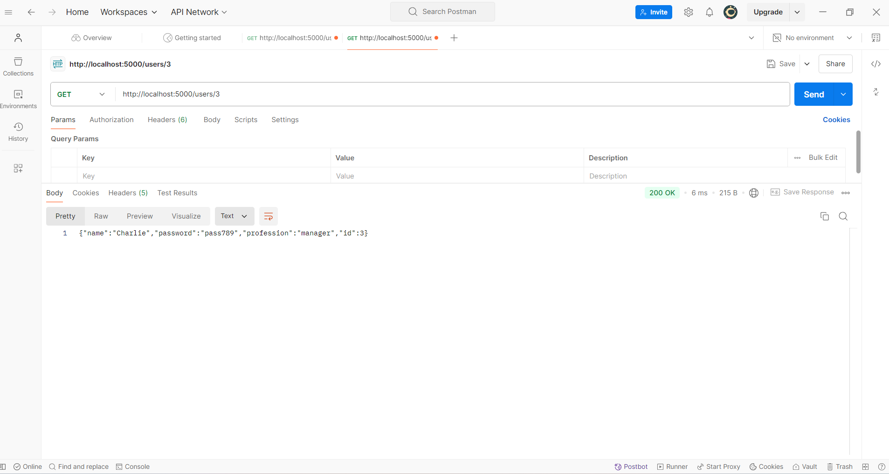
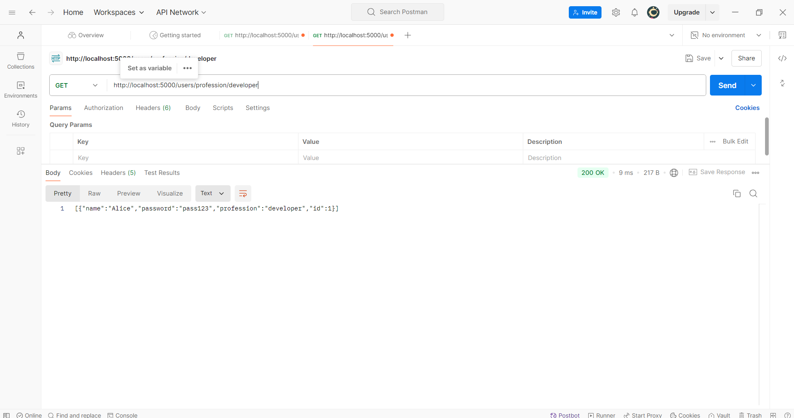
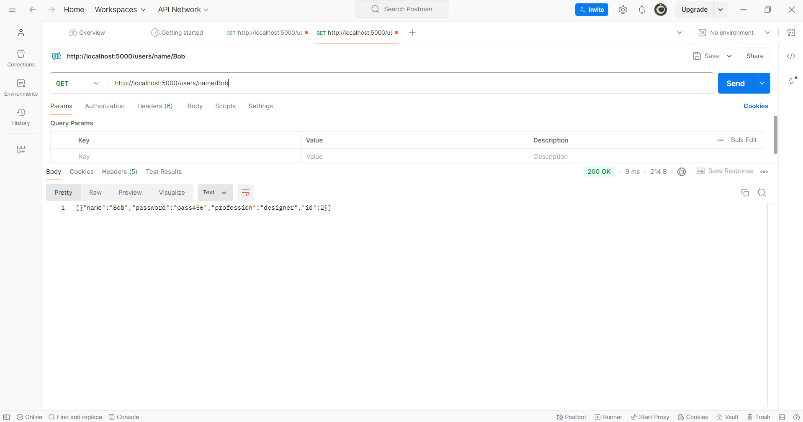

# Famous Akpovogbeta With Roll Number 10211100297

# Restful.Api
## User Information Management 

### Summary
This project demonstrates the development of a RESTful API using Node.js and Express. The API provides functionality to:
- Retrieve a list of all users.
- Fetch specific users by their ID.
- Search for users based on their profession.
- Find users by their names.

### Lessons Learned
Throughout the project, I have gained insights into:
- Designing and implementing RESTful APIs with dynamic endpoints.
- Managing file operations in Node.js using the fs module.
- Testing endpoints effectively using Postman.
- Building robust error-handling mechanisms for invalid inputs.

### Testing Process
Below are screenshots showing the API endpoints tested with Postman:

1. *All Users*: Retrieves a complete list of users via /users.  
   

2. *Specific User by ID*: Returns the details of a user for the specified ID through /users/:id.  
   

3. *Users by Profession*: Filters users by their profession using /users/profession/:profession.  
   

4. *User by Name*: Finds a specific user by their name using /users/name/:name.  
   

### Insights and Challenges
- Testing APIs with tools like Postman provided clarity in debugging and verifying functionality.
- Writing custom error messages for invalid requests (e.g., non-existent user IDs or professions) improved the user experience.
- I encountered challenges with ensuring the API responded gracefully to invalid or missing data files, which enhanced my understanding of error handling.

---

This project was a practical introduction to RESTful API development and provided valuable experience in creating, testing, and improving APIs for real-world applications.